# Glucose App

A personal, **local-only** iPhone app for the FreeStyle Libre 2 and Libre 2 Plus (EU) sensors. It reads glucose directly over Bluetooth and shows live values, trends, fully customizable alerts and statistics. Nothing is sent to any cloud.

> **Not a medical device.** This is a personal project without regulatory clearance. Use it as a secondary display. Always confirm with an approved device before any treatment decision, and keep a backup (reader or fingerstick meter). Share builds only with family on your own Apple Developer team (TestFlight internal testers), not with anyone else.


## Screenshots

Captured automatically in the iOS Simulator by the iOS build, using the demo sensor and sample data. The latest full set is attached to each [iOS build run](https://github.com/Leonidas-Antoniadis/glucose-app/actions/workflows/ios-build.yml) as the `screenshots` artifact.

| Home | Past values | Dark mode |
|:---:|:---:|:---:|
| 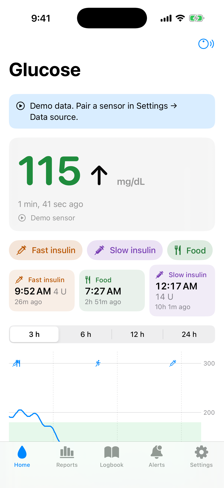 | 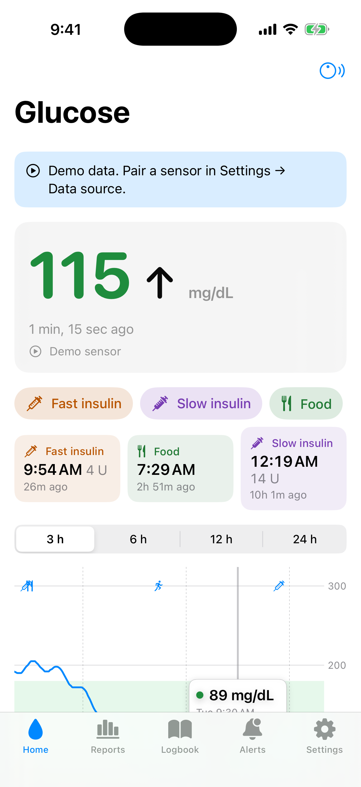 | 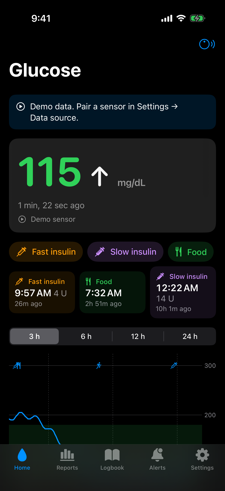 |
| Current value, trend and quick logging | Swipe back through 14 days; touch and hold to read a value | |

| Log an entry | Logbook | Reports |
|:---:|:---:|:---:|
| 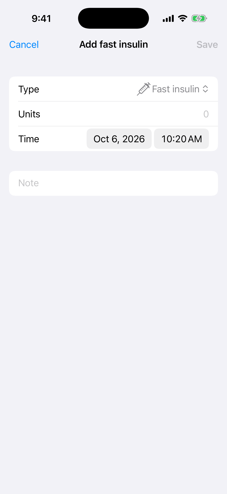 | 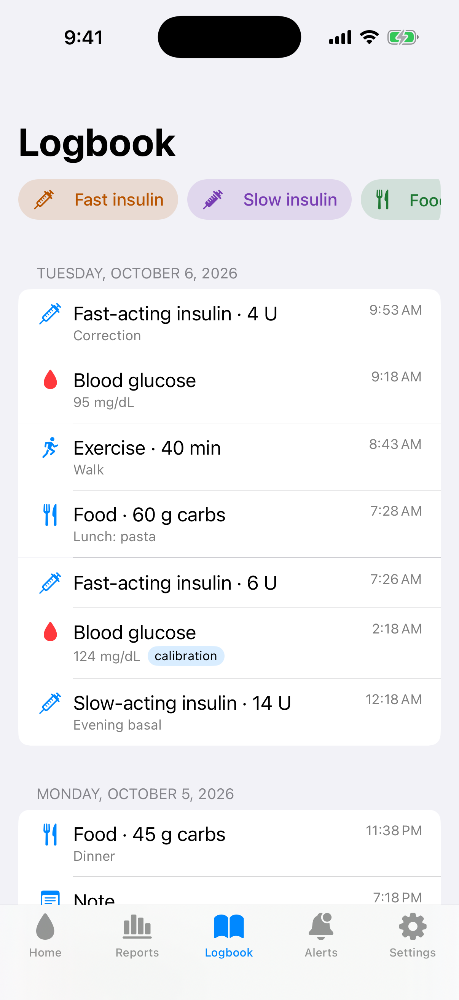 | 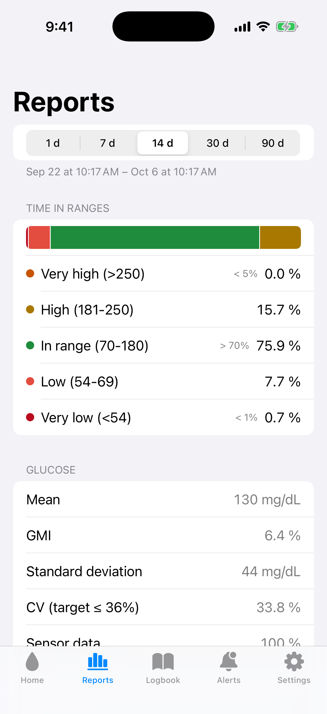 |
| Fast / slow insulin, food, exercise, blood glucose | One timeline, grouped by day | Time in ranges with consensus targets |

| Alerts | Alert editor | First launch |
|:---:|:---:|:---:|
| 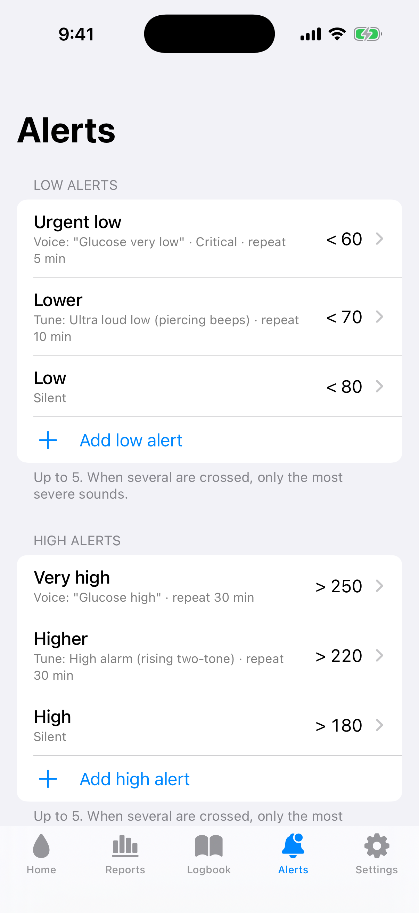 | 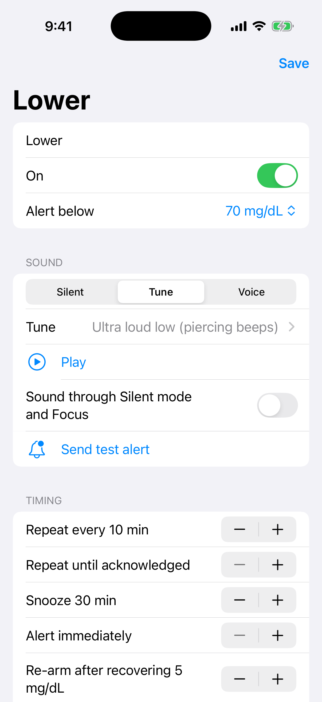 | 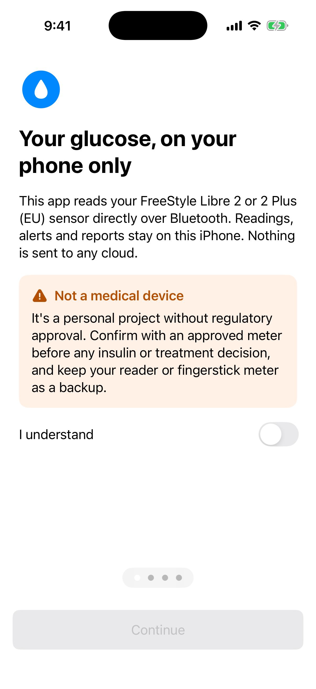 |
| 5 low + 5 high, separate low and high alarms | Sound, Critical Alert, repeat, snooze, schedule | Safety notice, units, presets, data source |

| Battery and Lock Screen |
|:---:|
| 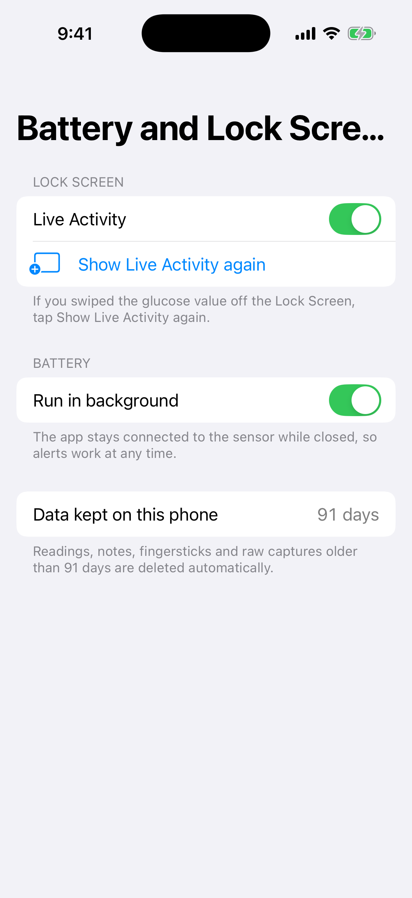 |
| Bring back the Live Activity, save battery, 91 days kept |

| Sensor | Raw sensor data | Packet bytes | Sensor history |
|:---:|:---:|:---:|:---:|
| 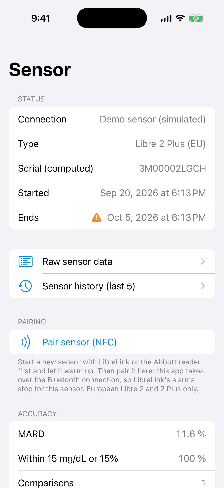 | 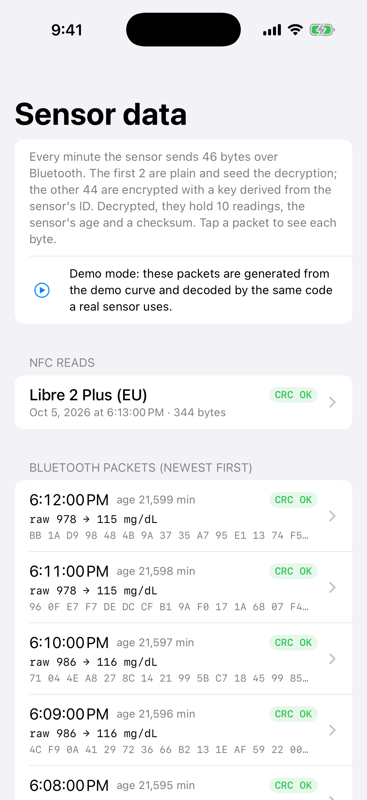 | 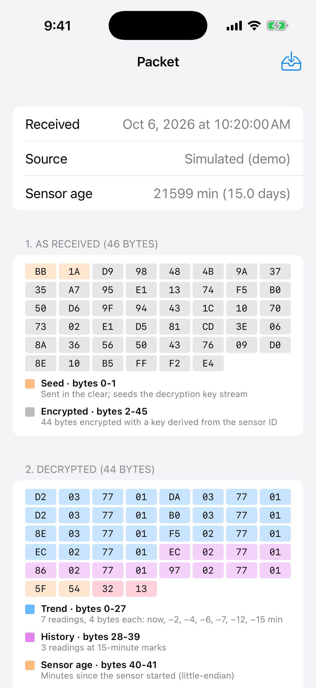 | 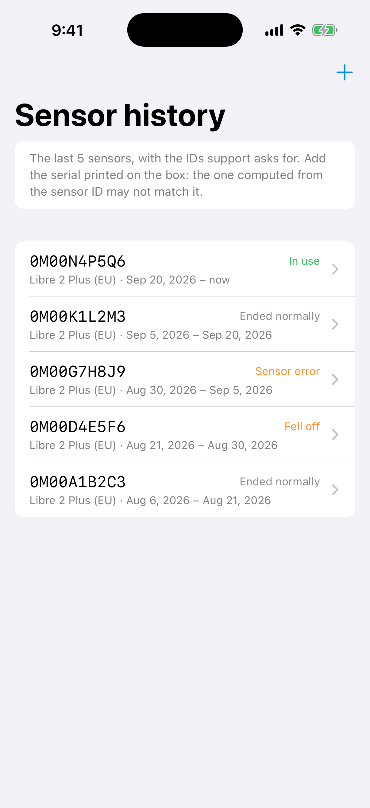 |
| Pairing, calibration, accuracy | Every packet and NFC read | Bytes colored by meaning | Last 5 sensors for support calls |

## Features

| Area | What it does |
|---|---|
| Sensor link | NFC pairing (takes over a sensor started with LibreLink), Bluetooth stream every minute, automatic reconnect and background restoration, NFC scan to fill gaps (8 h history) |
| Values | Fingerstick calibration of the raw signal (Abbott's algorithm isn't public), accuracy tracking (MARD, 15/15 band), mg/dL and mmol/L |
| Alerts | Up to 5 low + 5 high rules: silent / tune / voice, Critical Alert option, repeat, snooze, schedule, confirmation delay, re-arm margin. Only the most severe crossed rule sounds |
| Trend alerts | "Low soon" (20-minute projection), falling fast, rising fast |
| Other alerts | Missing data (scheduled ahead, fires even if the app is killed), sensor ending, Bluetooth off, low phone battery, app build expiring |
| Sounds | Separate low and high alarms (including ultra loud, high-pitched ones), chime, pulse, 9 voice clips, import your own tunes |
| Reports | 1-90 days: time in ranges with consensus targets, mean, GMI, SD, CV, day/night, AGP, daily overlay, PDF and CSV export |
| Logbook | Meals, insulin, exercise and notes, shown as chart markers |
| Privacy | All data on the phone, excluded from iCloud backup, kept for 91 days then deleted, optional Face ID lock, password-encrypted backup file |
| Battery | "Run in background" switch: off stops the sensor connection while the app is closed (no alerts then) and resumes when you open it |
| Surfaces | Home-screen and lock-screen widgets, Live Activity with Dynamic Island, button to bring the Live Activity back after swiping it away |
| Demo | A simulated sensor (real time or 60x) to try everything without a sensor |

## Repository layout

```
Packages/GlucoseCore/        Pure Swift, tested on Linux in CI
  Sources/GlucoseCore/       Units, readings, trend, alert engine, statistics, calibration, storage, exports
  Sources/LibreProtocol/     Libre 2 crypto, FRAM and BLE parsing, sensor record
App/
  project.yml                XcodeGen spec (Xcode project, Info.plists and entitlements are generated)
  GlucoseApp/                SwiftUI app: Model, Sensor (NFC, BLE), Services, Views, Resources/Sounds
  GlucoseWidget/             Widgets and Live Activity
  Shared/                    Code compiled into both
tools/generate-sounds.ps1    Regenerates the alert sounds on Windows
.github/workflows/           Linux tests; IPA build and simulator screenshots on macOS
```

## Developing without a Mac

Everything compiles in the cloud on GitHub Actions:

1. Push to `main`.
2. **Core tests** run `swift test` on Linux.
3. **iOS build** produces `GlucoseApp.ipa` (Actions → latest run → Artifacts) and a **screenshots** artifact with every screen, captured in the iOS Simulator.

### Installing with TestFlight

For family members on your Apple Developer team, see [TESTFLIGHT.md](TESTFLIGHT.md): every push to `main` uploads a new build automatically, and one script uploads from a Mac. It needs the paid Apple Developer Program, and each build lasts 90 days.

### Installing on your iPhone from Windows

1. Install [Sideloadly](https://sideloadly.io/). It needs the non-Microsoft-Store versions of iTunes and iCloud.
2. Download the `GlucoseApp-ipa` artifact from the latest **iOS build** run and unzip it.
3. Connect the iPhone by USB, drop the `.ipa` into Sideloadly and sign with your Apple ID.
4. On the iPhone: Settings → General → VPN & Device Management → trust your Apple ID, and enable Developer Mode.

**Free Apple ID:** the app expires after **7 days** and must be re-signed (the app warns you 24 h and 2 h before). NFC pairing isn't available to free accounts, so only the demo sensor works. If Sideloadly complains about entitlements, use its option to remove them.

**Paid Apple Developer Program:** 1-year signing, NFC, and the ability to request Critical Alerts. Needed before relying on the app.

## Using a real sensor

1. Start the sensor with LibreLink or the Abbott reader and let it warm up (60 min).
2. In the app: Home → sensor icon → **Pair sensor (NFC)**. LibreLink's alarms stop for that sensor from now on.
   - Or skip LibreLink: apply a new sensor, then tap **Start a new sensor (NFC)**. The app starts it and pairs it in one scan. This is experimental (not yet tried on a real sensor), starting can't be undone, and LibreLink may not give alarms for a sensor it didn't start. If you might want to switch back to LibreLink, start the sensor there instead.
3. Add a **fingerstick** when glucose is steady, and at least once a day. Until then values are rough estimates (raw ÷ 8.5).
4. Add some fingersticks *without* "Use to calibrate" to measure accuracy (MARD).

The protocol follows community reverse-engineering and is verified here only with synthetic data. Before taking over a sensor, the app checks that its data decodes; if it doesn't, nothing on the sensor changes and LibreLink keeps working. Failed reads are kept under **Sensor → Raw sensor data** so they can be shared to fix decoding. Keep that file private: it contains your sensor's ID.

### Common situations

| Situation | What happens |
|---|---|
| Taking over a sensor that's already running | No new warm-up. Pairing imports the last 8 hours right away; live readings start within 1-2 minutes. Add a fingerstick soon, since values are estimates until calibrated. |
| Pairing a sensor that's still warming up | Readings start after its first 60 minutes, and a "Sensor ready" notification arrives then. |
| Alerts in both apps? | No. The sensor streams to one app. After pairing here, LibreLink's alarms stop for that sensor. |
| Going back to LibreLink | Scan the sensor with LibreLink; it usually takes the sensor back (not guaranteed). This app then shows "No reading since …" with a **Pair again** button. |
| Scanning again while connected | Safe: it only reads the 8-hour history, fills gaps and doesn't disturb the Bluetooth link. |
| Pairing the same sensor again | Allowed; calibration is kept. |
| Phone left out of range | It reconnects by itself when you're back. Each Bluetooth packet only covers the last ~45 minutes, so a banner offers an NFC scan to fill longer gaps (the sensor keeps 8 hours). |
| Phone restarted | iOS only reconnects after the app has been opened once; the scheduled "No glucose data" alert reminds you. |

### Raw sensor data

**Sensor → Raw sensor data** shows each Bluetooth packet and NFC read as received, decrypted and decoded, with bytes colored by meaning. Recent packets are kept only in memory. To keep one on the phone, turn on **Save the next Bluetooth packet** (or NFC read), or swipe a packet and tap **Keep**. Kept data can be shared as a text file.

## Alert behaviour

- When several rules are crossed at once, only the **most severe** sounds; the rest are marked as handled.
- A rule fires once per crossing, repeats until acknowledged (or up to its max), and re-arms after recovery plus margin.
- The app warns before you remove or turn off your last alert at or below 60 mg/dL.
- Every decision is written to a decision log (Settings → Diagnostics).

## References

Protocol work is guided by the open-source projects [xDrip4iOS](https://github.com/JohanDegraeve/xdripswift), [DiaBLE](https://github.com/gui-dos/DiaBLE) and [LibreTransmitter](https://github.com/LoopKit/LibreTransmitter). Check their licences before reusing any code.
